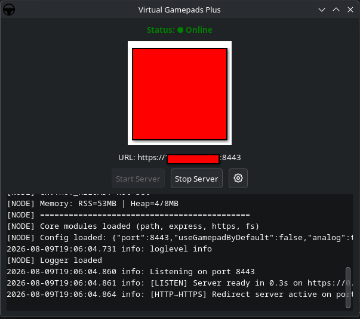
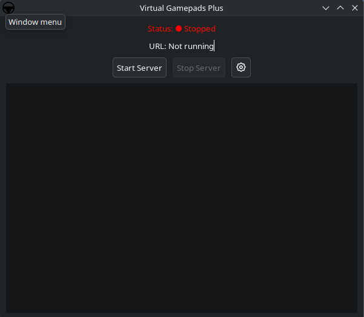
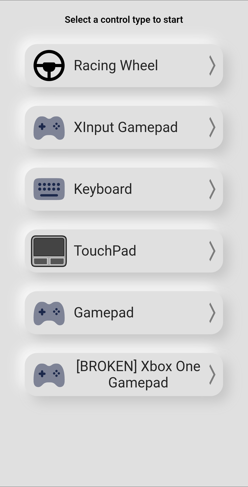
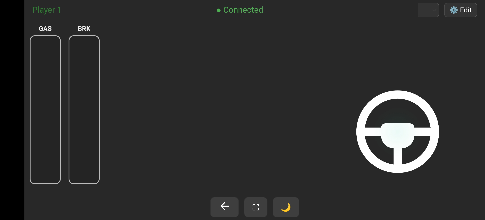
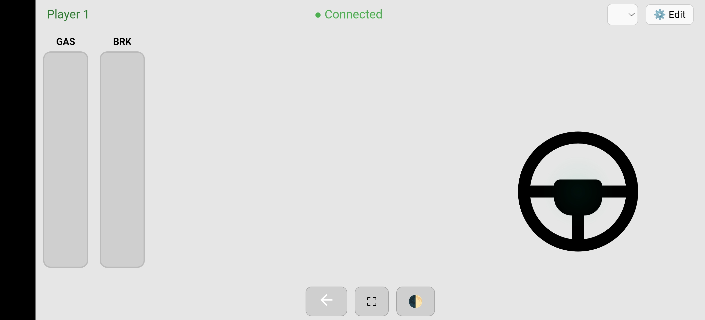
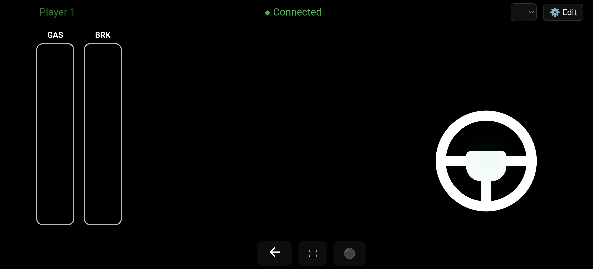
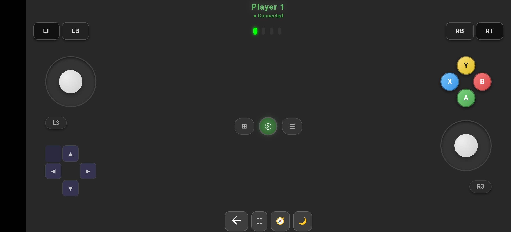
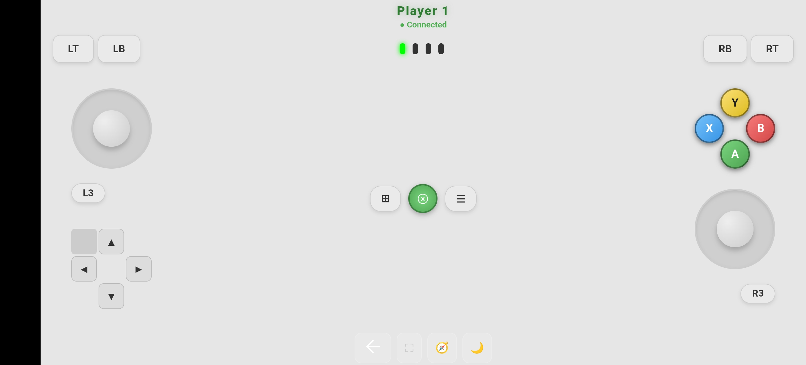
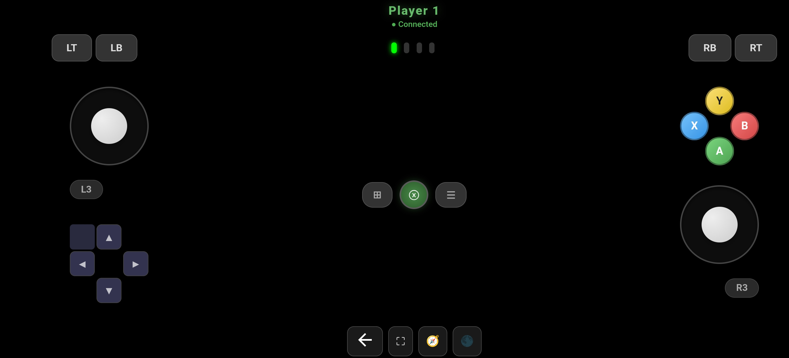
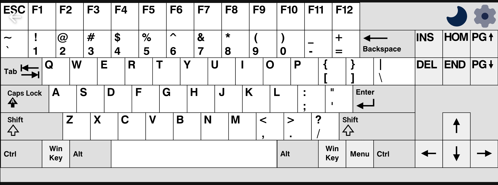

# Virtual Gamepad Plus


This repo is a fork of [alr86/node-virtual-gamepads-revived](https://github.com/alr86/node-virtual-gamepads-revived) (which is a fork of [jehervy/node-virtual-gamepads](https://github.com/jehervy/node-virtual-gamepads)) with ~~some~~ Many changes(just tested in linux, and will only ):

- Shows QR-Code to join 
- ~~Gyro support~~ [Partial, will be impelmented(Thats a big maybe)]
- Dark Mode
- An Script to test gamepads [still pending]
- Better styles(I'm a developer, not a designer, yeah?)
- ~~Also have "L2", "R2" & "Menu" buttons~~ [Don't know what they did on the other controller]
- XBOX-Style buttons layout with xinput support
- Steering wheel support with genuine steering wheel input
- ~~PreDefiend `.desktop` files to run script(needs change)~~ 
  
**Please note that what the other developer did with other things and stuff, are preserved as it is, as it doesnt conflict with new stuff. I thought It should be there as so that the Mantra of "If it works, dont f\*\*king touch it"**

View [TODO](#todo) for Upcoming stuffs, or stuff I gave up on

## Install and run:

### Automatic one(recommended):

```bash
    curl -fsSL https://raw.githubusercontent.com/uzair777-dev/Virtual-gamepads-plus/main/install.sh | bash
```

### Manual one:

```bash
    git clone https://github.com/uzair777-dev/Virtual-gamepads-plus
    cd Virtual-gamepads-plus
    # Make script executable by this command or gui
    chmod +x launch_gui.sh
    chmod +x run.sh
    # Running gui 
    ./launch_gui.sh
    # Or launch in terminal
    ./run.sh     
```
## Screenshots (New Version):

### Desktop Server GUI Manager
| Server Online (with QR) | Settings Panel |
| :---: | :---: |
|  |  |

| Server Offline | System Tray Icon |
| :---: | :---: |
|  |  |

---

### Controller Web Interfaces

#### 🏠 Controller Menu


#### 🏎️ Virtual Racing Wheel
| Dark Theme | Light Theme | AMOLED Black |
| :---: | :---: | :---: |
|  |  |  |

#### 🎮 Xbox Gamepad
| Dark Theme | Light Theme | AMOLED Black |
| :---: | :---: | :---: |
|  |  |  |

#### 🖱️ Touchpad & Keyboard(By older devs(untouched), but still works good!)
| Touchpad (Dark) | Touchpad (Light) | Virtual Keyboard |
| :---: | :---: | :---: |
|  |  |  |

---

## Old ScreenShot:
(Red L2-R2 Buttons over D-pad only works when gyro enabled)


---
## Node-Virtual-Gamepads ReadMe (Now updated for Virtual Gamepad Plus):

This nodejs application turns your smartphone into a gamepad controller only GNU/Linux OS simply by reaching a local address.
You can virtually plug in multiple gamepad controllers.

### Original Demo
----
Original Demo video 1 player in game [here](https://www.youtube.com/watch?v=OWgWugNsF7w)

Original Demo video 3 players on EmulStation [here](https://www.youtube.com/watch?v=HQROnYLRyOw)

Prerequisite
------------

> [!WARNING]
> This application is only compatible with Linux OSes with the **uinput** kernel module installed, Which most of them do. 

If you encounter problems while installing or running node-virtual-gamepads have
a look at the [troubleshooting](TROUBLESHOOTING.md) page.

You can now configure the server to your needs. Just open `config.json`
with the editor of you choice and adjust the values. Explanation of the
individual values can be found in [README_CONFIG.md](README_CONFIG.md).

## Features
--------
### Plug up to ~~4 virtual gamepads~~ (New limits unknown, but Lets assume 4 for now)
The application will plug automatically a new controller when the web application is launched and unplug it at disconnection.
4 slots are available so 4 virtual gamepads can be created. You can see your current slot on the indicator directly on the vitual gamepad.


### Enjoy haptic feedbacks
Because it's difficult to spot the right place in a touch screen without looking at it,
the touch zone of each button was increased. LT button was moved at the center of the screen
to let as much space as possible for the joystick and avoid touch mistakes.

> [!WARNING]
> The support in mordern controllers is a bit wonky, and needs to be worked on.
> To be precise, precise haptics (no pun intended) are not supported on browser, but itsstill very good, ngl

To know if we pressed a button with success, the web application provides an haptic feedback
which can be easily deactivated by turning off the vibrations of the phone.

### Use the keyboard to enter text


### Use the touchpad for mouse inputs


### An index page lets you choose


### Proper GTK Desktop Manager (finally no terminal-only struggle)
Got tired of running everything through terminal commands all the time, so I built a proper GTK GUI (`./launch_gui.sh`). It shows the status (Online/Starting/Offline), generates a QR code right on the screen so you just scan and connect on your phone, lets you set custom server ports, and even has a settings modal with system tray minimization support. Plus, all icons adapt automatically if you use light or dark GTK themes.


### Virtual Steering Wheel (with actual analog steering & pedals)
Wanted a proper racing wheel setup for sim games, so now there's a real virtual wheel mode with continuous analog steering axis! Also includes customizable throttle, brake, and clutch pedals (with adjustable pressure ramp speeds so it doesn't just snap to 100% instantly), camera joysticks, paddle shifters, and button mapping.


### Custom SVG Button Icons in Wheel Layout
You can pick custom SVG icons for your wheel buttons right from the edit menu (scanned dynamically from the server folder), complete with live mini previews in the settings menu. Just drop any `.svg` in `public/images/icons/buttons/` and it shows up.

### Multiple Theme Modes (AMOLED, Dark & Light)
Added theme options because bright white screens at night hurt. You can toggle between AMOLED Black (saves battery on OLED phones), Dark Mode, and Light Mode for all controllers (Wheel, Xbox Gamepad, Touchpad, Keyboard).

| Dark Theme | Light Theme | AMOLED Black |
| :---: | :---: | :---: |
|  |  |  |

### One-Command Auto Installer
Made `install.sh` handle uinput permissions, dependencies, desktop launcher shortcuts, and firewall rules automatically across Fedora, Arch, Ubuntu (, and /) Debian, Void, and Atomic distros (Bazzite/Silverblue/SteamOS). It should technically support most of their derivatives too, But idk, shit always breaks in all fun ways. Also, Gentoo users, I hatingly love you. I can't explain how i bashed my head against wall trying to get it to work for you guys. But as it stands, I, too am incapable of some stuff, or i might just be dumb, idk

## Developing
----------
Please read the [contribution guideline](CONTRIBUTING.md) first if you haven't already.

Clone this repository and install its dependencies with

    npm install

When you change something in a coffeescript (e.g. main.coffee) run

    npx coffee -c main.coffee

This will compile main.coffee to main.js which than can be run with node
(see [Installation](README.md#installation))
To compile all coffee files when ever they change run

    npx coffee -cw .

If you want do add a new keyboard layout please refer to [this file](CREATE_KEYBOARD_LAYOUT.md).


## TODO 

1) Fixing Stuff First:
    - [x] Proper multi device connect 
    - [ ]  Actual Multithreading 
    - [x] Proper Navigation for website
    - [ ] Remove depreciated stuff
2) GUI:
    - [ ] Implement a proper GUI
    - [ ] Optimise GUI
    - [ ] Other gui stuff, idk
    
3) Adding Support for wheel:
    - [x] Steering wheel native axis support
    - [x] Pedals support, with variable pressure sensitivity
    - [x] Shifter support(Can be added through buttons and can be mapped through the game itself. So I guess that counts?)
    - [x] Button mapping
    - [ ] Profile support(Kind of works, but aint complete)

4) Server-side profile management:
    - [ ] Add a settings page to load/save/edit profiles(Partially works, but not properly)
    - [ ] Save profiles to file, probabaly in ./config/controllerprofiles/ (?)
    - [ ] Auto-load last profile (based on client, idk how to, yet)
    
5) Better gyro implementation (This is pushed back in the development, will be resumed when other features are completed (or someone else implements it)):
    - [ ] Implement gyro first
    - [ ] Pitch/yaw smoothing
    - [ ] Optional reset button
    - [ ] Centering on button press

6) Profile switching(Yeah.. not having it):
    - [ ] ~~Quick profile toggle (LB/RB?)~~ (Yeah not doing that)
    - [ ] ~~Visual indicator for active profile~~(Not this one either)

7) UI/UX improvements:
    - [ ] Touch lock toggle (disable gyro on touch)
    - [x] Button remapping
    - [x] Custom button layouts per profile

8) Hardware compatibility:
    - [x] Test on real Android device
    - [ ] Test gyro on iOS (I don't have one)
9)  Performance:
    - [ ] Optimize gyro processing
    - [ ] Optimise the whole script in general
    - [ ] Reduce latency
    - [ ] Test battery impact

10) Advanced features:
    - [ ] Gyro-to-mouse mode(Steam controller type (?) idk)
    - [ ] Touchpad mode improvements
    - [ ] Keyboard layouts per profile
    
11) Documentation:
    - [ ] Some documentation as needed
    - [x] Add pictures of the new version 

12) Installation:
    - [x] Install script that does most of the work


